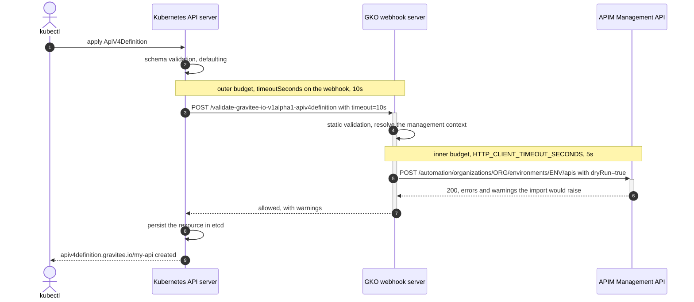
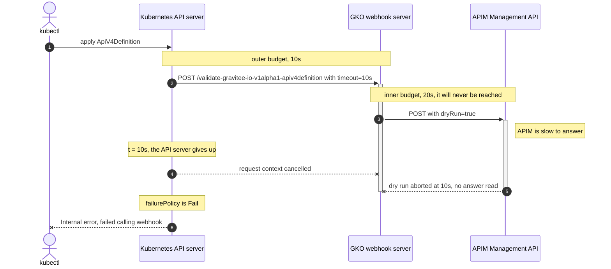

# Admission timeouts and the dry run round trip

When a custom resource references a management context, GKO does not wait for the reconcile loop to tell you that your
resource is invalid. It validates it during admission, by sending the resource to the APIM Management API with
`dryRun=true`. APIM answers with the errors and warnings it would have raised, and GKO turns them into an admission
response, so that `kubectl apply` fails immediately with an actionable message.

This means that a single `kubectl apply` opens **two nested timeout budgets**: the one the Kubernetes API server grants
to the webhook, and the one GKO grants to its own call to the Management API. This page describes the round trip, and
what happens when those two budgets are not aligned.

## The round trip

The example below applies an `ApiV4Definition` that carries a context reference. Defaults are used, so the API server
grants 10 seconds to the webhook, and GKO grants 5 seconds to the dry run.



Once the resource is persisted, the controller picks it up and replays the same call without `dryRun`, this time outside
of any admission budget.


The same round trip applies to every kind covered by the validating webhook. Kinds that also have a mutating webhook
registered (`managementcontexts`, `subscriptions`, `groups`, `dictionaries`, `portals`, `portallistings` and
`documentations`) go through the mutation phase first, under its own instance of the outer budget.


## Two nested budgets

| Budget | Where it is set | What it covers | Default |
| --- | --- | --- | --- |
| Outer, webhook call | `timeoutSeconds`, on every webhook of the validating and mutating configurations | The whole admission call, from the moment the API server dials the webhook to the moment it reads the response | 10s |
| Inner, Management API call | `HTTP_CLIENT_TIMEOUT_SECONDS`, from `manager.httpClient.timeoutSeconds` | One call issued by GKO to the Management API, the dry run included | 5s |

The inner budget must expire **before** the outer one. GKO builds its Management API requests from the admission
request context, so the two are not independent: when the API server gives up, the context is cancelled and the dry run
in flight dies with it.

## When the outer budget is too small

Raising `manager.httpClient.timeoutSeconds` above the webhook timeout, in front of a slow Management API, produces this:



`kubectl` reports the webhook, not APIM:


```text
Error from server (InternalError): error when creating "api.yml": Internal error occurred: failed calling webhook "v1alpha1.gravitee.io.apiv4definition": failed to call webhook: Post "https://gko-webhook.gravitee.svc:443/validate-gravitee-io-v1alpha1-apiv4definition?timeout=10s": context deadline exceeded
```


Two things are lost here:

- **The configured timeout never applies.** The dry run is cut at the outer budget, whatever value
  `manager.httpClient.timeoutSeconds` holds. Raising it has no visible effect.
- **The real cause is hidden.** Had GKO been given the time to hit its own timeout, it would have denied the request
  with the underlying error, which names the endpoint that did not answer:


```text
Error from server (Forbidden): error when creating "api.yml": admission webhook "v1alpha1.gravitee.io.apiv4definition" denied the request: unable to perform request [POST] https://apim.example.com/automation/organizations/DEFAULT/environments/DEFAULT/apis?dryRun=true: (Post "https://apim.example.com/automation/organizations/DEFAULT/environments/DEFAULT/apis?dryRun=true": context deadline exceeded (Client.Timeout exceeded while awaiting headers))
```


## How the chart keeps the budgets aligned

The chart derives the webhook timeout from the HTTP client timeout, and keeps 5 seconds of headroom for the rest of the
admission work, such as decoding the review, resolving the management context and reading its secret:

```text
webhook timeoutSeconds = min(manager.httpClient.timeoutSeconds + 5, 30)
```

| `manager.httpClient.timeoutSeconds` | Webhook `timeoutSeconds` |
| --- | --- |
| 5 (default) | 10 |
| 10 | 15 |
| 20 | 25 |
| 40 | 30, capped |


Kubernetes refuses a webhook `timeoutSeconds` above 30. Past 25 seconds of HTTP client timeout the headroom shrinks, and
at 30 seconds and beyond the client timeout can no longer be honoured during admission. If the Management API needs more
than that to answer a dry run, treat the latency itself as the problem rather than raising the timeout.


## Tuning and verifying

Give the Management API more time, on a high latency network for instance:

```sh
helm upgrade --install gko graviteeio/gko \
  -n gravitee --create-namespace \
  --set manager.httpClient.timeoutSeconds=20
```

Check that the webhooks followed:

```sh
kubectl get validatingwebhookconfiguration gko-validating-webhook-configurations \
  -o jsonpath='{.webhooks[*].timeoutSeconds}'
```

```text
25 25 25 25 25 25 25 25 25 25 25 25
```


Only the dry run is bound to these budgets. A resource that carries no context reference is still admitted through the
webhook, but validation stays local, so no Management API call is made and the inner budget never opens. Setting
`manager.webhook.enabled` to `false` removes admission altogether, which trades early feedback for a shorter apply path,
errors then surface in the resource status after reconciliation.

